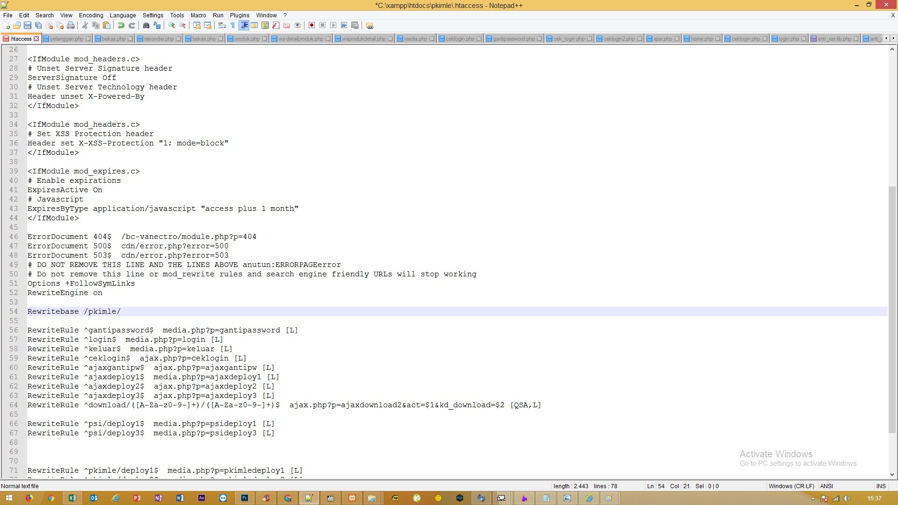
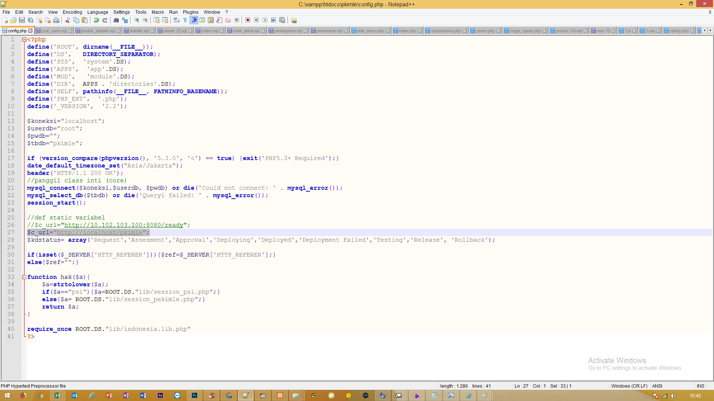

# Cara Instalasi PKIMLE

Cara instalasi awal
1. Download ZIP
2. Extract ZIP dan taruh di C:\xampp\htdocs\pkimle
3. Seting Folder di Htaacess dan juga config.php - [Seting Folder](#seting-folder)
4. Copy pkimle.sql sesuai dengan nama databasenya yang sudah dibuat

## Seting Folder
### 1. .HTACCESS

Rubah Rewritebase /pkimle/
Sesuai dengan nama folder di server
Contoh : Rewritebase /ready/

jika sudah jangan lupa konfigurasi config.php
dirubah menjadi seperti ini :

$koneksi="localhost"; --> Koneksi MYSQL
$userdb="root"; --> Username DB MYSQL
$pwdb=""; --> Password DB MYSQL
$tbdb="pkimle"; --> Nama DB MYSQL

$c_url="http://localhost/pkimle"; --> URL / Domain Webnya (Pkimle == Nama Foldernya)

